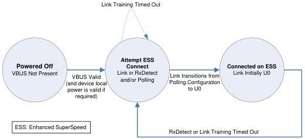

Revision 1.1
June 2022

- 399 -

Universal Serial Bus 3.2
Specification

A port exits the Error state only if a Warm Reset is received on the link or if Far-end Receiver Terminations are removed.

### 10.5.2 Hub Connect State Machine

The following sections provide a functional description of a state machine that exhibits correct hub behavior for when to connect on the Enhanced SuperSpeed bus or the USB 2.0 bus. For a hub, the connection logic for the Enhanced SuperSpeed bus and the USB 2.0 bus are completely independent. The hub shall follow the USB 2.0 specification for connecting on USB 2.0. Figure 10-13 is an illustration of the hub connect state machine for an Enhanced SuperSpeed hub. Each of the states is described in Section 10.5.2.1.

Figure 10-13. Hub Connect (HCONNECT) State Machine

### 10.5.2.1 Hub Connect State Descriptions

### 10.5.2.2 HCONNECT-Powered-off

The HCONNECT-Powered-off state is the default state for a hub device. A hub device shall transition into this state if the following situation occurs:

- From any state when VBUS is removed.

In this state, the hub upstream port's link shall be in the eSS.Disabled state.

### 10.5.2.3 HCONNECT.Attempt ESS Connect

A hub shall transition into this state if any of the following situations occur:

- From the HCONNECT-Powered-off state when VBUS becomes valid (and local power is valid if required).
- From the HCONNECT.Connected on ESS state if Rx.Detect or Link Training time out.

In this state, the hub's upstream port Enhanced SuperSpeed link is in Rx.Detect or Polling.

Copyright © 2022 USB 3.0 Promoter Group. All rights reserved.