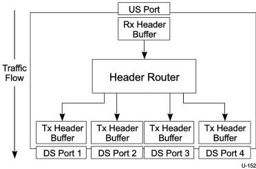
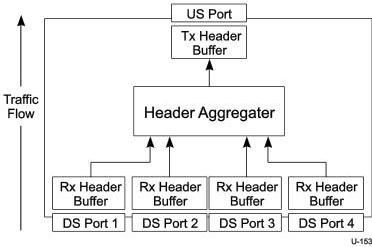

Revision 1.1
June 2022

- 406 -

Universal Serial Bus 3.2
Specification

**Figure 10-15. Example SS Hub Header Packet Buffer Architecture - Downstream Traffic**

**Figure 10-16. Example SS Hub Header Packet Buffer Architecture - Upstream Traffic**

The following lists functional requirements for a SuperSpeed hub buffer architecture with the assumption in each case that only the indicated port on the hub is receiving or transmitting header packets:

- A SuperSpeed hub starting with all header packet buffers empty shall be able to receive at least eight header packets directed to the same downstream port that is not in U0 before its upstream port runs out of header packet flow control credits.

Copyright © 2022 USB 3.0 Promoter Group. All rights reserved.