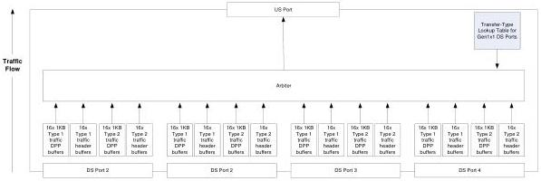

Revision 1.1
June 2022

- 408 -

Universal Serial Bus 3.2
Specification

### 10.8.2 SKP Ordered Sets

A SuperSpeedPlus hub transmits SKP ordered sets, following the rules for all transmitters in Chapter 6, for all transmissions.

### 10.8.3 Interpacket Spacing

When a hub originates or forwards packets, DPHs and their corresponding DPPs shall be sent as required in Section 7.2.1.

The SuperSpeedPlus hub has several aspects to its store and forward behavior including buffering, arbitration among packets to be forwarded upstream, and modifications of packets during forwarding.

### 10.8.4 Upstream Flowing Buffering

The SuperSpeedPlus hub shall provide buffering for 16 x 1 KB Control/Bulk DPP buffers and 16 x 1 KB Interrupt/Isochronous DPP buffers for each DFP receiver. The SuperSpeedPlus hub shall provide buffering for 16 x Control/Bulk header buffers and 16 x TP/Interrupt/Isochronous header buffers per DFP receiver. These buffers shall be used to hold packets received from downstream ports that are awaiting transmission on the upstream port.

Buffer space is required for each downstream port since there can be packets simultaneously arriving on each downstream port while there is a packet being transmitted on the upstream port. Further, the hub arbitration rules (see Section 10.8.6) can delay when a packet received on a downstream port can be transmitted on the upstream port.

Figure 10-17. Logical Representation of Upstream Flowing Buffers

### 10.8.5 Downstream Flowing Buffering

The SuperSpeedPlus hub shall provide enough buffering depending on the speed and number of lanes on the upstream port and the number of downstream ports.

The number of 1KB Control/Bulk DPP buffers and 1KB Interrupt/Isochronous DPP buffers (NBuf) shall be calculated as follows:

1. Determine the number of downstream ports to saturate upstream port

SpeedRatio = Upstream port speed/Gen 1x1 speed

Number of ports for saturation is N = Ceil (SpeedRatio)

Copyright © 2022 USB 3.0 Promoter Group. All rights reserved.