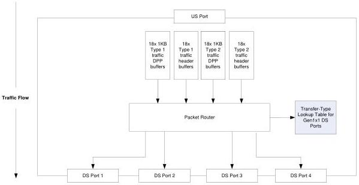

Revision 1.1
June 2022

- 409 -

Universal Serial Bus 3.2
Specification

2. Calculate the rate at which packets are consumed by the downstream ports assuming the devices attached downstream always accept DPs:

Packet Consumption Rate (PCR) = MaxBurst/SpeedRatio

3. Compute the number of buffers required:

NBuf = 0; i = 1;

While ((MaxBurst - |i*PCR|) > 0)

    NBuf += (MaxBurst - |i*PCR|); i++;

NBuf += N;

The SuperSpeedPlus hub shall provide buffering for an equivalent number of Control/Bulk header buffers and TP/Interrupt/Isochronous header buffers as well.

Buffering for downstream flowing traffic is primarily present to provide a rate matching function due to the different possible upstream port and downstream port speeds. Therefore, it is provided for each hub and not for each downstream port. However, the organization and function of this buffering shall allow packets to be received from the upstream port and then subsequently transmitted on multiple downstream ports simultaneously and in a different order than the order in which they were received. That is, this buffering cannot be organized as a single, simple FIFO.

Figure 10-18. Logical Representation of Downstream Flowing Buffers

### 10.8.6 SuperSpeedPlus Hub Arbitration of Packets

#### 10.8.6.1 Arbitration Weight

The i$^{th}$ downstream facing port (DFPi) has an arbitration weight (AW) associated with it. This weight shall be set to;

DFPi.AW = DFPi.link_speed / ArbitrationWeightBase

Copyright © 2022 USB 3.0 Promoter Group. All rights reserved.