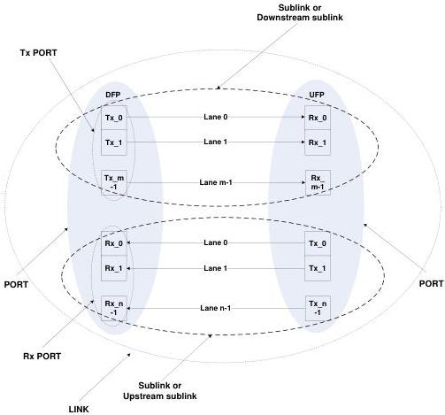

Revision 1.1  
June 2022

- 14 -

Universal Serial Bus 3.2  
Specification

**Figure 2-1. Port and Link Pictorial**

Figure 2-1 illustrates the parts of a port and the connection between ports. The USB 3.1 specification only defines a port with a single Tx and Rx. The inclusion of more than one Rx/Tx pair in a port is for harmonization with the SSIC specification where multiple Rx/Tx pairs are defined. Note: The meanings of the terms used in this figure are not the same as used in PCIe.

Copyright © 2022 USB 3.0 Promoter Group. All rights reserved.