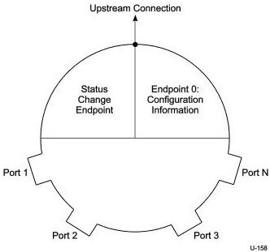

Revision 1.1
June 2022

- 425 -

Universal Serial Bus 3.2
Specification

be turned off when any of the over-current protection circuits indicates an over-current condition.

### 10.13 Hub Controller

The Hub Controller is logically organized as shown in Figure 10-21.

Figure 10-21. Example Hub Controller Organization

### 10.13.1 Endpoint Organization

The Hub Class defines one additional endpoint beyond the default control pipe, which is required for all hubs: the Status Change endpoint. This endpoint has the maximum burst size set to one. The host system receives port and hub status change notifications through the Status Change endpoint. The Status Change endpoint is an interrupt endpoint. If no hub or port status change bits are set, then the hub returns an NRDY when the Status Change endpoint receives an IN (via an ACK TP) request. When a status change bit is set, the hub will send an ERDY TP to the host. The host will subsequently ask the Status Change endpoint for the data, which will indicate the entity (hub or port) with a change bit set. The USB system software can use this data to determine which status registers to access in order to determine the exact cause of the status change interrupt.

Copyright © 2022 USB 3.0 Promoter Group. All rights reserved.