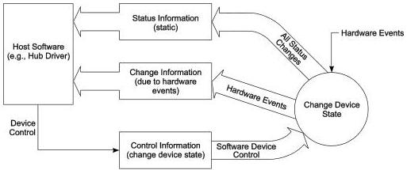

Revision 1.1
June 2022

- 426 -

Universal Serial Bus 3.2
Specification

### 10.13.2 Hub Information Architecture and Operation

Figure 10-22 shows how status, status change, and control information relate to device states. Hub descriptors and Hub/Port Status and Control are accessible through the default control pipe. The Hub descriptors may be read at any time. When a hub detects a change on a port or when the hub changes its own state, the Status Change endpoint transfers data to the host in the form specified in Section 10.13.4.

Hub or port status change bits can be set because of hardware or software events. When set, these bits remain set until cleared directly by the USB system software through a ClearPortFeature() request or by a hub reset. While a change bit is set, the hub continues to report a status change when the Status Change endpoint is read until all change bits have been cleared by the USB system software.

Figure 10-22. Relationship of Status, Status Change, and Control Information to Device States

U-159

The USB system software uses the interrupt pipe associated with the Status Change endpoint to detect changes in hub and port status.

Copyright © 2022 USB 3.0 Promoter Group. All rights reserved.