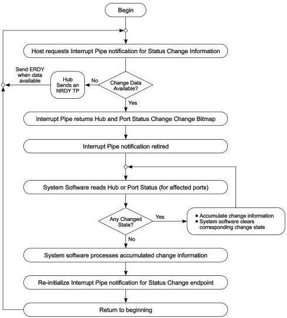

Revision 1.1
June 2022

- 427 -

Universal Serial Bus 3.2
Specification

### 10.13.3 Port Change Information Processing

Hubs report a port's status through port commands on a per-port basis. The USB system software acknowledges a port change by clearing the change state corresponding to the status change reported by the hub. The acknowledgment clears the change state for that port so future data transfers to the Status Change endpoint do not report the previous event. This allows the process to repeat for further changes (see Figure 10-23).

Figure 10-23. Port Status Handling Method

U-180

### 10.13.4 Hub and Port Status Change Bitmap

The Hub and Port Status Change Bitmap, shown in Figure 10-24, indicates whether the hub or a port has experienced a status change. This bitmap also indicates which port(s) have had a change in status. The hub returns this value on the Status Change endpoint. Hubs report this value in byte-increments. For example, if a hub has six ports, it returns a byte quantity, and reports a zero in the invalid port number field locations. The USB system software is aware of the number of ports on a hub (this is reported in the hub descriptor)

Copyright © 2022 USB 3.0 Promoter Group. All rights reserved.