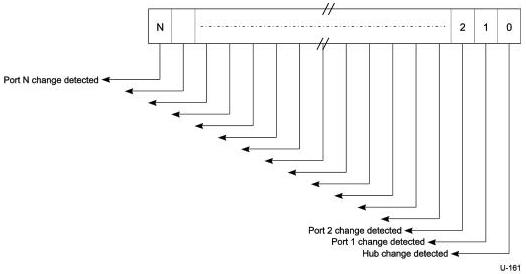
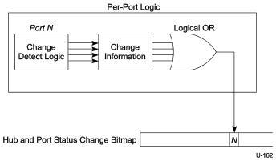

Revision 1.1
June 2022

- 428 -

Universal Serial Bus 3.2
Specification

and decodes the Hub and Port Status Change Bitmap accordingly. The hub reports any changes in hub status in bit zero of the Hub and Port Status Change Bitmap.

The Hub and Port Status Change Bitmap size is two bytes. Hubs report only as many bits as there are ports on the hub. A USB hub may have no more than nMaxHubPorts.

Figure 10-24. Hub and Port Status Change Bitmap

Any time any of the Status Changed bits are non-zero, an ERDY is returned (if an NRDY was previously sent) notifying the host that the Hub and Port Status Change Bitmap has changed. Figure 10-25 shows an example creation mechanism for hub and port change bits.

Figure 10-25. Example Hub and Port Change Bit Sampling

### 10.13.5 Over-current Reporting and Recovery

USB devices shall be designed to meet applicable safety standards. Usually, this will mean that a self-powered hub implements current limiting on its downstream facing ports. If an over-current condition occurs, it causes a status and state change in one or more ports. This change is reported to the USB system software so that it can take corrective action.

Copyright © 2022 USB 3.0 Promoter Group. All rights reserved.