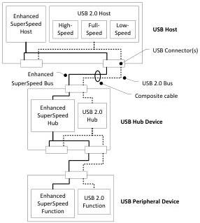

Revision 1.1
June 2022

- 16 -

Universal Serial Bus 3.2
Specification

Figure 3-1. USB 3.2 Dual Bus System Architecture

The USB 3.2 interconnect is the manner in which USB 3.2 and USB 2.0 devices connect to and communicate with the USB 3.2 host. The USB 3.2 interconnect inherits core architectural elements from USB 2.0, although several are augmented to accommodate the dual bus architecture.

The baseline structural topology is the same as USB 2.0. It consists of a tiered star topology with a single host at tier 1 and hubs at lower tiers to provide bus connectivity to devices.

The USB 3.2 connection model accommodates backward and forward compatibility for connecting USB 3.2 or USB 2.0 devices into either a USB Type-C connector or a USB 3.1 legacy connector. Similarly, USB 3.2 devices can be attached to a USB 2.0 legacy connector. The mechanical and electrical backward/forward compatibility for USB 3.2 is accomplished via a composite cable and associated connector assemblies that form the mechanical infrastructure for the dual-bus architecture. USB 3.2 peripheral devices accomplish backward compatibility by including both Enhanced SuperSpeed and USB 2.0 interfaces. USB 3.2 hosts have both Enhanced SuperSpeed and USB 2.0 interfaces, which are essentially parallel buses that may be active simultaneously.

The USB 3.2 connection model allows for the discovery and configuration of USB devices at the highest signaling speed supported by the peripheral device, the highest signaling rate supported by hubs between the host and peripheral device, and the current host capability and configuration.

USB 3.2 hubs are a specific class of USB device whose purpose is to provide additional connection points to the bus beyond those provided by the host. In this specification, non-hub devices are referred to as peripheral devices in order to differentiate them from hub devices. In addition, in USB 2.0 the term "function" was sometimes used interchangeably with device. In this specification a function is a logical entity within a device, see Figure 3-3.

Copyright © 2022 USB 3.0 Promoter Group. All rights reserved.