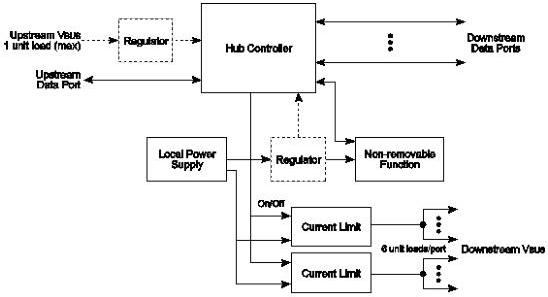

Revision 1.1
June 2022

- 465 -

Universal Serial Bus 3.2
Specification

Figure 11-1. Compound Self-powered Hub

The maximum number of ports that can be supported is limited by the capability of the local VBus supply.

### 11.4.1.1.1 Over-Current Protection

The host and all self-powered hubs must implement over-current protection for safety reasons, and the hub must have a way to detect the over-current condition and report it to the USB software. Should the aggregate current drawn by a gang of downstream facing ports exceed a preset value, the over-current protection circuit removes or reduces power from all affected downstream facing ports. The over-current condition is reported through the hub to the Host Controller, as described in Section 10.13.5. The preset value cannot exceed 5.0 A and must be sufficiently higher than the maximum allowable port current or time delayed such that transient currents (e.g., during power up or dynamic attach or reconfiguration) do not trip the over-current protector. If an over-current condition occurs on any port, subsequent operation of the USB is not guaranteed, and once the condition is removed, it may be necessary to reinitialize the bus as would be done upon power-up. The over-current limiting mechanism must be resettable without user mechanical intervention. Polymeric PTCs and solid-state switches are examples of methods that can be used for over-current limiting.

### 11.4.1.2 Low-power Bus-powered Devices

A low-power device is one that draws up to one unit load from the USB cable when operational. Figure 11-2 shows a typical bus-powered, low-power device, such as a mouse. Low-power regulation can be integrated into the device silicon. Low-power devices must be capable of operating with input VBus voltages as low as 4.00 V, measured at the plug end of the cable at the device.

Copyright © 2022 USB 3.0 Promoter Group. All rights reserved.