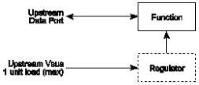
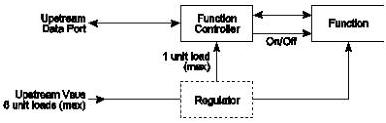

Revision 1.1
June 2022

- 466 -

Universal Serial Bus 3.2
Specification

Figure 11-2. Low-power Bus-powered Function

### 11.4.1.3 High-power Bus-powered Devices

A device is defined as being high-power if, when fully powered, it draws over one but no more than six unit loads from the USB cable. A high-power device requires staged switching of power. It must first come up in a reduced power state of less than one unit load. At bus enumeration time, its total power requirements are obtained and compared against the available power budget. If sufficient power exists, the remainder of the device may be powered on. High-power devices shall be capable of operating with an input voltage as low as 4.00 V. They must also be capable of operating at full power (up to six unit loads) with an input voltage of 4.00 V, measured at the plug end of the cable at the device.

A typical high-power device is shown in Figure 11-3. The device's electronics have been partitioned into two sections. The device controller contains the minimum amount of circuitry necessary to permit enumeration and power budgeting. The remainder of the device resides in the function block.

Figure 11-3. High-power Bus-powered Function

### 11.4.1.4 Self-powered Devices

Figure 11-4 shows a typical self-powered device. The device controller is powered either from the upstream bus via a low-power regulator or from the local power supply. The advantage of the former scheme is that it permits detection and enumeration of a self-powered device whose local power supply is turned off. The maximum upstream power that the device controller can draw is one unit load, and the regulator block must implement inrush current limiting. The amount of power that the device block may draw is limited only by the local power supply. Because the local power supply is not required to power any downstream bus ports, it does not need to implement current limiting, soft start, or power switching.

Copyright © 2022 USB 3.0 Promoter Group. All rights reserved.