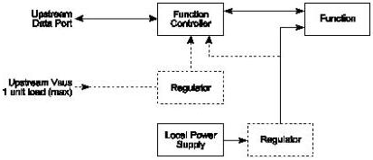

Revision 1.1
June 2022

- 467 -

Universal Serial Bus 3.2
Specification

Figure 11-4. Self-powered Function

### 11.4.2 Steady-State Voltage Drop Budget

This analysis is based on the following:

- 3 meter cable assembly with A-series and B-series plugs
- #22AWG wire used for power and ground (0.019 Ω/foot)
- A-series and B-series plug/receptacle pair have a contact resistance of 30 mΩ
- Wire ~380 mΩ series resistance
- IR Drop at device = (((2 * 30 mΩ) + 190 mΩ) * 900 mA) * 2 or 0.450 V

The steady-state voltage drop budget is determined by:

- The nominal 5 V source is 4.75 V to 5.50 V.
- The maximum voltage drop (for detachable cables) between the USB A-series plug and USB B-series plug on VBUS is 171 mV.
- The maximum current for the calculations is 0.9 A.
- The maximum voltage drop for all cables between upstream and downstream on GND is 171 mV.
- The maximum voltage drop for all mated connectors is 27 mV.
- All hubs and peripheral devices shall be able to provide configuration information with as little as 4.00 V at the device end of their B-series receptacle. Both low and high-power devices need to be operational with this minimum voltage.

Copyright © 2022 USB 3.0 Promoter Group. All rights reserved.