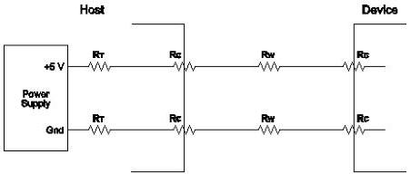

Revision 1.1
June 2022

- 468 -

Universal Serial Bus 3.2
Specification

Figure 11-5. Worst-case System Equivalent Resistance

Rt Host Trace Resistance: 0.167 Ω

Rc Mated Connector Resistance: 0.030 Ω

Rw Cable Resistance: 0.190 Ω

Note that under transient conditions, the supply at the device can drop to 3.67 V for a brief moment.

### 11.4.3 Power Control During Suspend/Resume

All USB devices may draw up to 2.5 mA during suspend. When configured, bus-powered compound devices may consume a suspend current of up to 12.5 mA. This 12.5 mA budget includes 2.5 mA suspend current for the internal hub plus 2.5 mA suspend current for each port on that internal hub having attached internal functions, up to a maximum of four ports. When computing suspend current, the current from VBUS through the bus pull-up and pull-down resistors must be included.

While in the Suspend state, a device may briefly draw more than the average current. The amplitude of the current spike cannot exceed the device power allocation 150 mA (or 900 mA). A maximum of 1.0 second is allowed for an averaging interval. The average current cannot exceed the average suspend current limit (ICCS, see Table 11-2) during any 1.0 second interval. The profile of the current spike is restricted so the transient response of the power supply (which may be an efficient, low-capacity, trickle power supply) is not overwhelmed. The rising edge of the current spike must be no more than 100 mA/μs. Downstream facing ports must be able to absorb the 900 mA peak current spike and meet the voltage droop requirements defined for inrush current during dynamic attach. Figure 11-6 illustrates a typical example profile for an averaging interval.

Copyright © 2022 USB 3.0 Promoter Group. All rights reserved.