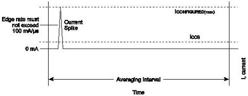

Revision 1.1
June 2022

- 469 -

Universal Serial Bus 3.2
Specification

Figure 11-6. Typical Suspend Current Averaging Profile

Devices are responsible for handling the bus voltage reduction due to the inductive and resistive effects of the cable. When a hub is in the Suspend state, it must still be able to provide the maximum current per port (six unit loads per port for self-powered hubs). This is necessary to support remote wakeup-capable devices that will power-up while the remainder of the system is still suspended. Such devices, when enabled to do remote wakeup, must drive resume signaling upstream within 10 ms of starting to draw the higher, non-suspend current. Devices not capable of remote wakeup must not draw the higher current when suspended.

When devices wakeup, either by themselves (remote wakeup) or by seeing resume signaling, they must limit the inrush current on VBUS. The device must have sufficient on-board bypass capacitance or a controlled power-on sequence such that the current drawn from the hub does not exceed the maximum current capability of the port at any time while the device is waking up.

### 11.4.4 Dynamic Attach and Detach

The act of plugging or unplugging a hub or peripheral device must not affect the functionality of another device on other segments of the network. Unplugging a device will stop any transactions in progress between that device and the host. However, the hub or root port to which this device was attached will recover from this condition and will alert the host that the port has been disconnected.

#### 11.4.4.1 Inrush Current Limiting

When a peripheral device or hub is plugged into the network, it has a certain amount of on-board capacitance between VBUS and ground. In addition, the regulator on the device may supply current to its output bypass capacitance and to the device as soon as power is applied. Consequently, if no measures are taken to prevent it, there could be a surge of current into the device which might pull the VBUS on the hub below its minimum operating level. Inrush currents can also occur when a high-power device is switched into its high-power mode. This problem must be solved by limiting the inrush current and by providing sufficient capacitance in each hub to prevent the power supplied to the other ports from going out of tolerance. An additional motivation for limiting inrush current is to minimize contact arcing, thereby prolonging connector contact life.

The maximum droop possible in the bus-powered hub VBUS is 330 mV. In order to meet this requirement, the following conditions must be met:

- The maximum load (CRPB) that can be placed at the downstream end of a cable is 10 μF in parallel with as small as a 27 Ω resistance. The 10 μF capacitance represents

Copyright © 2022 USB 3.0 Promoter Group. All rights reserved.