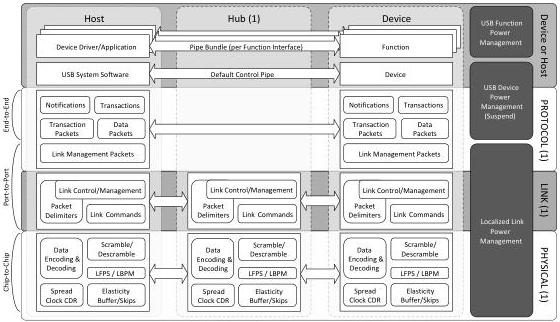

Revision 1.1
June 2022

- 20 -

Universal Serial Bus 3.2
Specification

Figure 3-3. Enhanced SuperSpeed Bus Communications Layers and Power Management Elements

(1) Definition is Gen X dependent

The rows (device or host, protocol, link, physical) realize the communications layers of the Enhanced SuperSpeed interconnect. Sections 3.2.1 through 3.2.3 provide architectural overviews of each of the communications layers. The three, left-most columns (host, hub, and device) illustrate the topological relationships between devices connected to the Enhanced SuperSpeed bus; refer to the overview in Sections 3.2.6 through 3.2.7. The right-most column illustrates the influence of power management mechanisms over the communications layers; refer to the overview in Section 3.2.5.

### 3.2.1 Physical Layer

The Gen X physical layer specifications are detailed in Chapter 6. The physical layer defines the PHY portion of a port and the physical connection between a downstream facing port (on a host or hub) and the upstream facing port on a device. The Gen X physical connection is comprised of two differential data pairs (one transmit path and one receive path) for each lane. Dual-lane support (Gen X x 2) is defined to enable two lane operation over the USB Type-C cable and connector.

The electrical aspects of each path are characterized as a transmitter, channel, and receiver; these collectively represent a unidirectional differential sublink. Each differential sublink is AC-coupled with capacitors located on the transmitter side of the differential sublink. The channel includes the electrical characteristics of the cables and connectors.

At an electrical level, each differential sublink is initialized by enabling its receiver termination. The transmitter is responsible for detecting the far end receiver termination as an indication of a bus connection and informing the link layer so the connect status can be factored into link operation and management.

When receiver termination is present but no signaling is occurring on the differential sublink, it is considered to be in the electrical idle state. When in this state, low frequency

Copyright © 2022 USB 3.0 Promoter Group. All rights reserved.