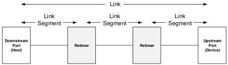

Revision 1.1
June 2022

- 490 -

Universal Serial Bus 3.2
Specification

minimum set re-driver behavioral and electrical requirement are defined to provide a reference re-driver implementation guideline. In addition, a system-level re-driver integration and link performance analysis are recommended to ensure maximum re-driver interoperability.

Captive re-timer or on-board re-driver refers to a re-timer or re-driver that is located on the same host or device system. The re-timer or re-driver is said to be associated with the host or device.

Link segment applies to re-timer only and it refers to a transmitter-channel-receiver combination between:

- A downstream port and a re-timer upstream port
- an upstream port and a re-timer
- two re-timers

This is shown in Figure E-1.

Figure E-1. Link Segment Definition

### E.1.2 Scope of the Re-time Connectivity and Link Delay Budget

The scope of this Appendix covers SRIS re-timers and bit-level re-timers, which may be used on a printed circuit board in conjunction with a host or device, or as part of a cable assembly.

The USB usage model, which matches hosts, devices and cables at the time of usage, allows for the construction of systems that include re-timers on all three components. The requirements set forth in this Appendix comprehend the use of up to four re-timers in system configurations where a host and/or a device implementation may differ with respect to Pending_HP_Timer timeout value. Note that the Pending_HP_Timer timeout value varies based on different revisions of the specifications.

### E.1.2.1 Re-timer Connectivity Models

This section defines the maximum number of re-timers allowed in two specific link connectivity models. Each contains an active cable with two re-timers. Those two connectivity models are the foundation to define the number of captive re-timers allowed and the link delay budget among host, device, active cable, and re-timers.

The two link connectivity models are defined based on host and device implementations with different Pending_HP_Timer timeout values.

- 3-μs host or device: implementations based on USB 3.1 Specification Revision 1.0 (July 26, 2013) and earlier revision that conform to the minimum Pending_HP_Timer timeout value of 3 μs. Note that 3-μs host or device applies only to x1 operation.

Copyright © 2022 USB 3.0 Promoter Group. All rights reserved.