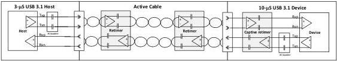
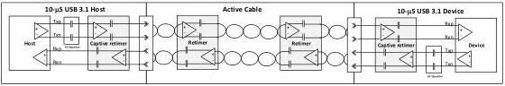

Revision 1.1
June 2022

- 491 -

Universal Serial Bus 3.2
Specification

- 10-μs host or device: implementations based on USB 3.1 Specification Revision 1.0 (July 26, 2013) in conjunction with USB 3.1 Pending_HP_Timer ECN, and future Revisions incorporating this ECN, that conform to the minimum Pending_HP_Timer timeout value of 10 μs. Note that a 10-μs USB 3.1 host or device implementation also incorporates USB 3.1 PM_Timer ECN and USB 3.1 Ux_LFPS_Exit ECN. Note that 10-μs host or device may apply to either x1 or x2 operation.

### E.1.2.1.1 3-Re-timer Connectivity

The 3-re-timer connectivity refers to connectivity of a 3-μs host or device that is connected with a 10 μs device or host. Under this configuration, a maximum of three re-timers may be supported, one with a 10-μs host or device, the other two may be in an active cable. Note that there is no re-timer in a 3 μs device or host.

An example link configuration is shown in Figure E-2, with a 3-μs host, and two re-timers in the active cable, interoperating with a 10-μs device including one re-timer on the device implementation. Note that it is assumed that a 3-μs host or device does not need retiming.

Figure E-2. Example Link Configuration of a 3-μs Host with a 10-μs Device

### E.1.2.1.2 4-Re-timer Connectivity

The 4-re-timer connectivity refers to a 10-μs host or device connected to a 10-μs device or host. Under this configuration, a maximum of four re-timers may be supported.

An example link configuration is shown in Figure E-3, with a 10-μs host connected with a 10-μs device through an active cable.

Figure E-3. Example Link Configuration of a 10-μs Host with a 10-μs Device

### E.1.2.2 Link Delay Budget Requirement

The link delay budget requirements is defined based on the 3-re-timer connectivity model in x1 operation. It is bounded by Pending_HP_Timer shown in Figure E-4.

- The total link delay budget is 2800 ns. This is defined assuming the following timings of a 3-μs host or device operating in x1 mode.

- The Pending_HP_Timer timeout value is 3 μs.
- The combined Tx data path and Rx data path delays are 200 ns.

Copyright © 2022 USB 3.0 Promoter Group. All rights reserved.