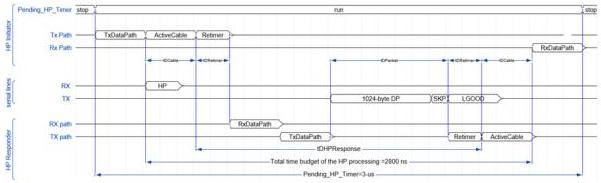

Revision 1.1
June 2022

- 492 -

Universal Serial Bus 3.2
Specification

### E.1.2.2.1 Gen 1x1 Link Delay Budget

The link delay budget of the 3-re-timer connectivity model in Gen 1x1 operation is divided with reference to the connectivity model defined in Section E.1.2.1.1.

- tDCable: The propagation delay of the cable up to maximum 125 ns. This includes the propagation delay of the cable up to 5 m cable with a maximum of two re-timers.
- tDRe-timer: The maximum delay of a single re-timer up to 50 ns.
- tDHPResponse: The maximum delay of the HP response time not exceeding 2540 ns. Note that this includes the worst case delay (tDPacket = 2140 ns) when additional packets are scheduled ahead of the link command. Refer to Section 7.5.6.1 for definition of the HP response time.

### E.1.2.2.2 Gen 2x1 Link Delay Budget

The link delay budget of the 3-re-timer connectivity model in Gen 2x1 operation is divided with reference to the connectivity model defined in Section E.1.2.1.2.

- tDCable: The propagation delay of the cable up to maximum 305 ns. This includes the propagation delay of the cable up to 5 m cable with a maximum of two re-timers.
- tDRe-timer: The maximum delay of a single re-timer up to 140 ns.
- tDHPResponse: The maximum delay of the HP response time not exceeding 1610 ns. Note that this includes the worst case delay (tDPacket = 910 ns) when additional packets are scheduled ahead of the link command. Refer to Section 7.5.6.1 for definition of HP response time.

Figure E-4. Link Delay Budget in 3-re-timer Connectivity Model

### E.2 Re-timer Architectural Overview and Requirement

A re-timer's responsibility is to restore an attenuated incoming signal to the quality matching the transmitter requirement defined in Chapter 6 before re-transmission. To meet the transmit jitter requirement defined in Table 6-20, a SRIS re-timer relies on a local reference clock that is asynchronous to the recovered clock at its incoming data. This asynchronicity introduces phase and frequency offset between the incoming data and the outgoing data. For a bit-level re-timer, the clock used to transmit data is derived from a recovered clock on its incoming data. Only phase offset but no frequency offset is introduced.

A re-timer may be implemented to support x1 or x2 operation. This section summarizes the general requirements at PHY and Link Layers.

Copyright © 2022 USB 3.0 Promoter Group. All rights reserved.