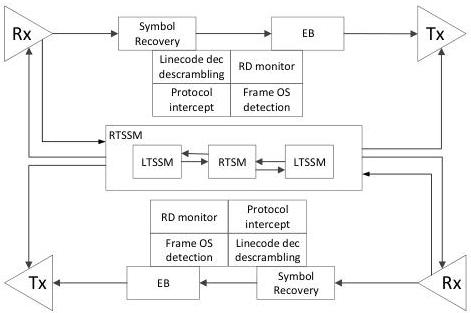

Revision 1.1
June 2022

- 493 -

Universal Serial Bus 3.2
Specification

### E.2.1 Architectural Overview

Shown in Figure E-5 are two high level re-timer architectural examples. In concept, each re-timer consists of a downstream port and an upstream port to perform clock data recovery at its receivers and data transmission at its transmitters. Each port may have its own LTSSM to manage the operation in various link states, and both LTSSMs are very similar to LTSSM defined in Chapter 7, but with differences unique to re-timer operation that are described in Section E.1. A re-timer state machine (RTSM) is employed to coordinate the operation between its upstream port and downstream port. In addition, RTSM is also responsible for, but is not limited to, serve the following management functions:

- Link state detection and re-timer power management.
- Data path management and clock offset compensation.
- Packet/link command detection.

A practical implementation of a re-timer may be architected with a single re-timer training and status state machine (RTSSM) to perform the link operation carried by LTSSM and RTSM.

Figure E-5. Example Re-timer Architectures

(a) Example Block Diagram of a SRIS Re-timer Architecture

Copyright © 2022 USB 3.0 Promoter Group. All rights reserved.