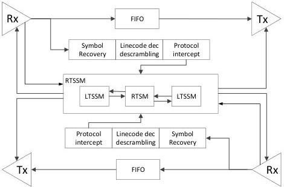
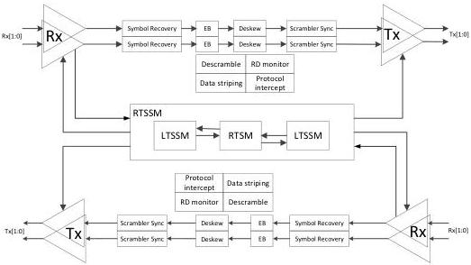

Revision 1.1
June 2022

- 494 -

Universal Serial Bus 3.2
Specification

(b) Example Block Diagram of a Bit-Level Re-timer Architecture

(c) Example Block Diagram of a x2 Re-timer Architecture

### E.2.2 General Requirements

A re-timer shall include the capability to successfully train and operate in both Gen 1 and Gen 2 modes. This includes implementation of all training and power states defined in Chapters 6 and 7.

The timing budgets, signal levels, and compliance specifications defined in Chapter 6 apply to re-timers. As with SuperSpeed and SuperSpeedPlus hosts and devices, SRIS re-timers shall implement the spread spectrum clocking (SSC) in compliance with the requirements contained in Section 6.5.3 and 6.5.4.

Copyright © 2022 USB 3.0 Promoter Group. All rights reserved.