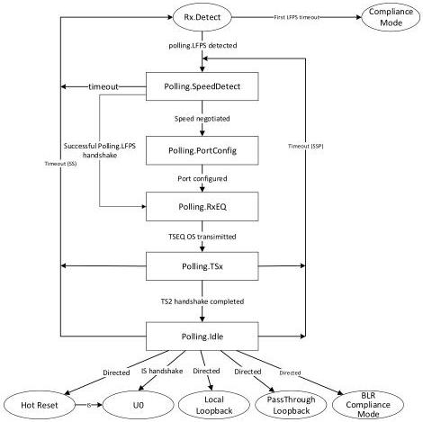

Revision 1.1
June 2022

- 500 -

Universal Serial Bus 3.2
Specification

Figure E-7. Polling Substate Machine

### E.3.4.1 Polling.SpeedDetect

Polling.SpeedDetect is a substate that covers the following substates in LTSSM.

- Polling.LFPS
- Polling.LFPSPlus
- Polling.PortMatch

The re-timer's responsibility in this substate includes:

- Forward the LFPS based signals include Polling.LFPS, SCD1/SCD2, and LBPM.
- Decode the LFPS signal including SCD1, SCD2, and LBPM to determine the negotiated data rate.

#### E.3.4.1.1 Polling.SpeedDetect Requirements

- The re-timer shall decode the following received LFPS signals and monitor the status and progression of LTSSM.

- Polling.LFPS
- SCD1/SCD2

Copyright © 2022 USB 3.0 Promoter Group. All rights reserved.