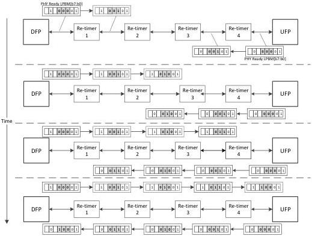

Revision 1.1
June 2022

- 503 -

Universal Serial Bus 3.2
Specification

Figure E-8. Illustration of Re-timer Presence Announcement

Refer to Table 7-13, in x2 operation, bits [4:2] of the PHY Ready LBPM is specified for re-timers to announce their presence. This is achieved by a re-timer incrementing bits [4:2] upon receiving the PHY Ready LBPM. When DFP and UFP transmit the PHY Ready LBPM, bits [4:2] are set to "000". When re-timer 1 received the PHY Ready LBPM from DFP, it will increment bits [4:2] by one, and passes it to re-timer 2. Re-timer 2, upon receiving the PHY Ready LBPM from re-timer 1, will perform the same by incrementing bits [4:2] by one, and again passes it to re-timer 3. This process continues until all re-timers complete the PHY Ready LBPM reception, bits [4:2] increment, and forwarding. Upon receiving the PHY Ready LBPM, UFP may decode bits [4:2] to determine how many re-timers that may be present between DFP and UFP. Note that the values of bits [4:2] of the PHY Ready LBPM also implies the re-timer relative proximity to DFP. For example, the value of bits [4:2] of the PHY Ready LBPM re-timer 2 forwarded is "010". This means there is one re-timer, or two link segments between DFP and re-timer 2. Note also that the same process happens from UFP to DFP. Once DFP received the PHY Ready LBPM, it may determine the number of re-timers between DFP and UFP. Furthermore, the unique value of bits [4:2] each re-timer asserted while forwarding the PHY Ready LBPM from DFP to UFP, also represents a unique address index such that DFP may use in future revisions to communicate with each re-timers.

### E.3.4.2.2 Polling.PortConfig Requirements

- The re-timer shall not forward any PHY Ready LBPMs before it is ready for training at both ports. In x2 operations, the re-timer shall get both lanes ready for training. This include, for example, enabling the receiver termination at its non-Configuration Lane that may be disabled during the prior link substates.

Copyright © 2022 USB 3.0 Promoter Group. All rights reserved.