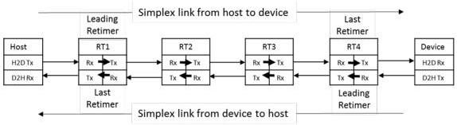

Revision 1.1
June 2022

- 506 -

Universal Serial Bus 3.2
Specification

Figure E-9. Sequential Bit-Level Re-timer Clock Switching

To facilitate a successful sequential clock switching among bit-level re-timers two ordered sets, TS1A OS and TS1B OS, are defined based on TS1 OS. Note that the definition of TS1A OS and TS1B OS still serve the function to train the host and device but prevent them from declaring the successful exit handshake from Polling.Active before all bit-level re-timers complete the clock and OS switching. TS1A OS and TS1B OS definitions are shown in Table E-1 and Table E-2. Note that symbols 4-9 of the ordered sets are TS1A OS and TS1B OS identifiers. TS1A OS is defined to indicate that a bit-level re-timer is either in clock recovery state, or in a state that the received clock is recovered, and it is waiting for its following bit-level re-timer to complete the clock switching. TS1B OS is defined for a bit-level re-timer to indicate to its preceding bit-level re-timer that it has completed the clock switching. Note that receiving TS1 OS is also an indicator that the bit-level re-timer is either connected directly to the host or device or a SRIS re-timer, or its following bit-level re-timer has completed clock and OS switching.

- A bit-level re-timer shall declare successful receiver training if eight consecutive and identical TS1A OS or TS1B OS or TS1 OS are received.
- A bit-level re-timer shall declare successful TS1B OS reception if one TS1B OS is received.

Table E-1. Gen 1 TS1A Ordered Set (TS1A OS)

[tbl-282.md](tbl-282.md)

Table E-2. Gen 1 TS1B Ordered Set (TS1B OS)

[tbl-283.md](tbl-283.md)

A bit-level re-timer shall perform the clock and OS switching based on the following steps. Refer to Figure E-11 as an example process of RT1 and RT2 completing their clock switching in the simplex link from the device to the host.

Copyright © 2022 USB 3.0 Promoter Group. All rights reserved.