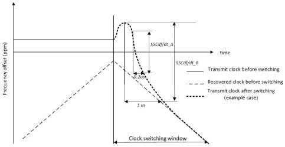

Revision 1.1
June 2022

- 507 -

Universal Serial Bus 3.2
Specification

- Upon entry to Polling.TSx, a bit-level re-timer shall transmit TS1A OS based on its local transmit clock at both ports with SSC disabled. It shall train its receiver at both ports based on TS1 OS, TS1A OS or TS1B OS while transmitting TS1A OS.
- Upon declaring successful receiver training, a bit-level re-timer shall perform one of the following.

○ If it has detected TS1 OS or TS1B OS at one simplex link, it shall perform the clock switching at its other simplex link and comply with the electrical and timing requirements defined in Chapter 6. It shall continue the TS1A OS transmission at both ports. Note that a bit-level re-timer may receive TS1 OS and/or TS1B OS at both ports. Under this situation, a bit-level re-timer shall perform the clock switching at both simplex links.
○ If it has detected TS1A OS, it shall continue the TS1A OS transmission while waiting for incoming TS1 OS or TS1B OS.

- During the clock switching, a bit-level re-timer shall attempt to minimize the frequency jump when switching from its transmit clock based on the local reference clock to the transmit clock based on the recovered clock. This is to maximally ensure its following link partner to maintain its CDR lock during the clock switching. A bit-level re-timer shall comply with the short-term SSCdf/dt clock switching requirement specified in Table E-3.

Table E-3. Bit-Level Re-timer Short-Term Clock Switching Requirement¹

[tbl-284.md](tbl-284.md)

Note 1: The requirements are outside the specification defined, thus interoperability may not be formally guaranteed but are strongly believed to be adequate.

Note 2: Refer to Figure E-10 for SSCdf/dt_A and SSCdf/dt_B definition.

Figure E-10. Definition of SSCdf/dt_A and SSCdf/dt_B

Copyright © 2022 USB 3.0 Promoter Group. All rights reserved.