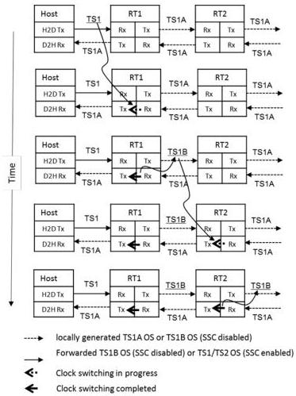

Revision 1.1
June 2022

- 508 -

Universal Serial Bus 3.2
Specification

- Upon completing the clock switching in one simplex link, a bit-level re-timer shall transmit TS1B OS in its other simplex link to signal its preceding re-timer.
- Upon completing the clock switching at both simplex, a bit-level re-timer shall perform the ordered set switch. The symbol boundary shall be preserved when switching from the local TS1B OS to the received TS1 OS or TS1B OS.

Shown in Figure E-12 is an example of four bit-level re-timers performing the clock switching at both simplex.

Figure E-11. Sequential Bit-Level Re-timer Clock Switching Based on TS1A OS and TS1B OS

Copyright © 2022 USB 3.0 Promoter Group. All rights reserved.