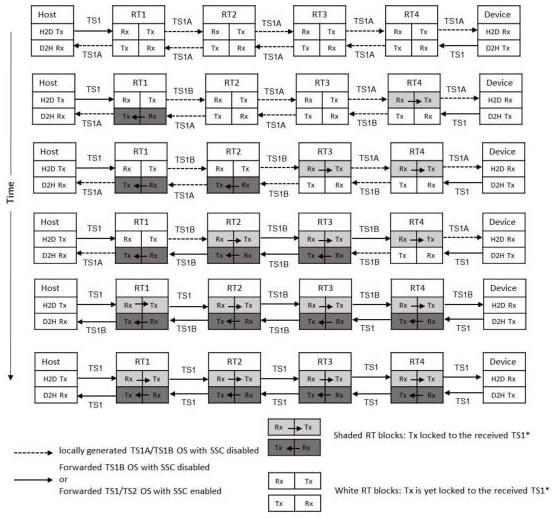

Revision 1.1
June 2022

- 509 -

Universal Serial Bus 3.2
Specification

Figure E-12. Example of Four Bit-Level Re-timer Performing Sequential Clock Switching

### E.3.4.4.2 Polling.TSx Requirements

- The lane polarity inversion detection and correction shall be completed before forwarding.
- The re-timer shall monitor the status and progression of LTSSM.
- Upon entry to this substate, a SRIS re-timer shall either transmit the local TS1 OS if received TS1 OS is not detected or forward the received TS1 OS if it's already recovered.
- A SRIS re-timer shall preserve the OS boundary and in Gen 2 mode, maintain the scrambler synchronization when switching from the local TS1 OS to recovered TS1 OS or TS2 OS. A SRIS re-timer shall not forward any TS2 OS until both ports are ready to forward TS1/TS2 OS.
- A SRIS re-timer shall perform the clock offset compensation based on the following.
  - For SS operation, it shall perform the clock offset compensation as defined in Section E.4.1.

Copyright © 2022 USB 3.0 Promoter Group. All rights reserved.