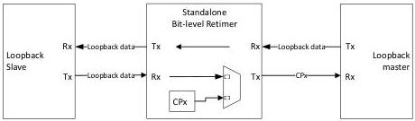

Revision 1.1
June 2022

- 512 -

Universal Serial Bus 3.2
Specification

### E.3.5.2 Exit from Compliance Mode

- The re-timer shall transition to Rx.Detect if WarmReset is detected or if directed.

### E.3.6 BLR Compliance Mode

BLR Compliance Mode is a bit-level re-timer specific test mode for transmitter compliance test. It applies to Gen 1x1 operation only. Shown in Figure E-13 is a test setup for a standalone bit-level re-timer Compliance Mode. Note that the loopback master may be the compliance test handler capable of sending the bit-level re-timer into transmitter compliance test, directing the bit-level re-timer to advance compliance patterns, and analyzing compliance patterns. The loopback slave can either be a compliant host or device, or another compliance test handler. Also note that this configuration applies to transmitter compliance test of a re-timer in the captive environment. For transmitter compliance test of the re-timers in an active cable, it is implementation specific to configure the re-timers, with one under test in BLR Compliance Mode, and the other in PassThrough Loopback.

Figure E-13. Standalone Bit-Level Re-timer Compliance Test Setup

### E.3.6.1 BLR Compliance Mode Requirements

- A bit-level re-timer shall monitor the LFPS signal at both ports.
- It shall set its data path from the loopback master to the loopback slave in PassThrough Loopback.
- It shall set its data path from the loopback slave to the loopback master in transmitter compliance test by transmitting the locally generated compliance pattern based on the recovered clock from the loopback slave.
- It shall advance the compliance pattern if four consecutive SKP OS are detected at forwarding data path. It shall advance sequentially from CP0 to CP8, and back to CP0.

### E.3.6.2 Exit from BLR Compliance Mode

- The re-timer shall transition to Rx.Detect if WarmReset is detected or if directed.

### E.3.7 U0

U0 is the normal operational state where packets are forwarded by the re-timer in both directions.

### E.3.7.1 U0 Requirements

- The re-timer shall monitor and decode the link command to participate in re-timer and link power management.

Copyright © 2022 USB 3.0 Promoter Group. All rights reserved.