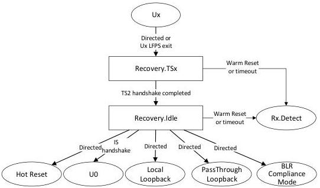

Revision 1.1
June 2022

- 519 -

Universal Serial Bus 3.2
Specification

- The re-timer shall transition to Rx.Detect upon the expiration of the tRecoveryIdleTimeout timer if no successful idle symbol handshake has been observed.
- The re-timer shall transition to Rx.Detect if Warm Reset is detected. Refer to Section E.3.1 for Warm Reset detection.

Figure E-14. Recovery Substate Machine

### E.3.12 PassThrough Loopback

PassThrough Loopback is a re-timer specific state defined by the Loopback bit (Bit 2) in the link configuration field of TS2 OS. In this state the re-timer operation shall be the same as if it is in U0, except that no error correction is allowed. The re-timer does not need to implement the two substates.

#### E.3.12.1 PassThrough Loopback Requirements

- The re-timer shall monitor the LTSSM progression.
- The re-timer shall not perform any error correction while looping through the traffic. Additionally, in Gen 1 operation, it shall perform one of the following.
  - Forward all data as is including bit errors.
  - Replace an error symbol with K28.4. Note that the re-timer shall preserve the running disparity at its transmitter but is not required to use the same disparity as decoded by the remove receiver.
- A SRIS re-timer shall perform the clock offset compensation as necessary.
- The re-timer shall implement and start the tLoopbackExitTimeout timer upon detecting Loopback LFPS exit signal.
- In x2 operations, the re-timer shall pass the received data on each lane independently. The transmitter lane to lane skew does not need to be maintained.

Copyright © 2022 USB 3.0 Promoter Group. All rights reserved.