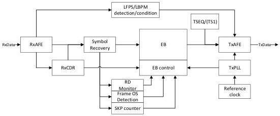

Revision 1.1
June 2022

- 521 -

Universal Serial Bus 3.2
Specification

- The re-timer shall disable and reset the tHotResetActiveTimeout timer and start the tHotResetExitTimeout timer upon detecting successful TS2 OS based Hot Reset.Active handshake.

# E.3.14.2 Exit from Hot Reset

- The re-timer shall transition to U0 upon observing successful Hot Reset.Exit handshake or any link command.
- The re-timer shall transition to Rx.Detect if one of the following conditions is met.
  o Upon timeout of the tHotResetActiveTimeout timer and no successful Hot Reset.Active handshake is observed.
  o Upon timeout of the tHotResetExitTimeout timer and no successful Hot Reset.Exit handshake is observed.
  o Upon detecting Warm Reset.

# E.4 SRIS Re-timer Clock Offset Compensation

A SRIS re-timer is expected to implement a reference clock to facilitate its data transmission. Shown in Figure E-15 is an example block diagram of a SRIS re-timer implementation based on separate reference clock.

Figure E-15. Example Block Diagram of a Re-timer Operating in Gen 2 Mode

# E.4.1 Gen 1x1 Operation

In Gen 1x1 operation, SKP OS defined for the clock offset compensation only considers the need by a host or device. There is no additional SKP OS budgeted for SRIS re-timers when in U0, Polling.TSx, Recovery, Hot Reset and PassThrough Loopback. A SRIS re-timer shall perform its clock offset compensation in those states based on implementation specific mechanisms, which are out of the scope of this appendix.

# E.4.2 Gen 1x2 Operation

Re-timers shall perform its clock offset compensation as defined in Section 6.4.3.1.

- The maximum re-timer delay tDretimer shall not exceed 300 ns.

# E.4.3 Gen 2 Operation

Re-timers shall perform its clock offset compensation as defined in Section 6.4.3.2.

Copyright © 2022 USB 3.0 Promoter Group. All rights reserved.