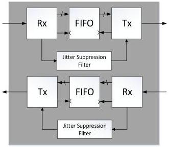

Revision 1.1
June 2022

- 522 -

Universal Serial Bus 3.2
Specification

- The maximum re-timer delay tDretimer in Gen 2x2 operation shall not exceed 200 ns.

### E.5 Bit-Level Re-timer Jitter Transfer Function

This section describes the normative jitter transfer function (JTF) requirements for bit-level re-timers. Bit-level re-timers which use the recovered clock from the input data stream as the input clock for the transmitter can pass on low frequency jitter, which can in turn result in accumulation of excessive low frequency jitter in systems with cascaded bit-level re-timers. The JTF requirements defined in this section ensure that a host or device receiver does is not subjected to input jitter that exceeds the amounts specified in the jitter tolerance requirements contained in Section 6.8.5.

In specifying the bit-level re-timer JTF requirements, the conceptual clocking architecture shown in Figure E-16 is assumed. Note that the actual clocking architecture for a given product is an implementation choice.

Figure E-16. Block Diagram for Example Bit-Level Re-timer Clocking Architecture

The jitter transfer function for a re-timer with this clocking architecture is

$$H_{JTF\_TX}(s) = H_{JTF\_RX}(s) \cdot H_{JSF}(s) \tag{E.1}$$

where $H_{JTF\_RX}(s)$ is the jitter transfer function for the re-timer receiver clock recovery

$H_{JSF}(s)$ is the jitter transfer function for the jitter suppression filter.

The transfer function for a second order CDR typical of high-speed signaling systems is expressed as:

$$H_{JTF\_RX}(s) = \frac{2\zeta_{Rx}\omega_{nRx}s + \omega_{nRx}^2}{s^2 + 2\zeta_{Rx}\omega_{nRx}s + \omega_{nRx}^2} \tag{E.2}$$

Copyright © 2022 USB 3.0 Promoter Group. All rights reserved.