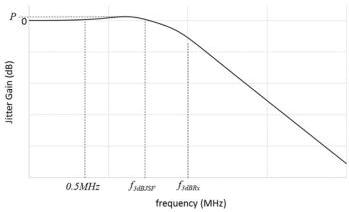

Revision 1.1
June 2022

- 523 -

Universal Serial Bus 3.2
Specification

The transfer function for the jitter suppression filter may be either first order or second order, depending upon implementation. The reference JTF curves in Figure E-18 assume a second order filter with transfer function expressed as:

$$H_{JSF}(s) = \frac{2\zeta_{JSF}\omega_{nJSF}s + \omega_{nJSF}^2}{s^2 + 2\zeta_{JSF}\omega_{nJSF}s + \omega_{nJSF}^2} \tag{E.3}$$

where $\omega_{nRs}$ is the natural frequency of the re-timer CDR

$\zeta_{Rs}$ is the damping factor of the re-timer CDR

$\omega_{nJSF}$ is the natural frequency of the low pass jitter suppression filter (JSF)

$\zeta_{JSF}$ is the damping factor of the low pass jitter suppression filter (JSF)

The relationship of the 3 dB frequencies of the CDR and JSF to their natural frequencies and damping factors are

$$\omega_{3dBRs} = \omega_{nRs} \left( 1 + 2 \zeta_{Rs}^2 + \left[ (1 + 2 \zeta_{Rs}^2)^2 + 1 \right]^{\frac{1}{2}} \right)^{\frac{1}{2}} \tag{E.4}$$

$$\omega_{3dBJSF} = \omega_{nJSF} \left( 1 + 2 \zeta_{JSF}^2 + \left[ (1 + 2 \zeta_{JSF}^2)^2 + 1 \right]^{\frac{1}{2}} \right)^{\frac{1}{2}} \tag{E.5}$$

The jitter transfer function for this system is illustrated in Figure E-17. Bit-level re-timers shall meet the normative jitter gain requirements defined in Table E-4. In addition, the re-timer shall meet all normative timing and electrical requirements defined in Chapter 6. A set of reference curves for SuperSpeed Gen 1x1 re-timers are shown in Figure E-18.

Figure E-17. Jitter Transfer Illustration

Copyright © 2022 USB 3.0 Promoter Group. All rights reserved.