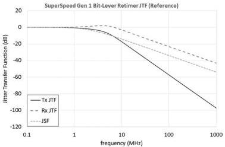

Revision 1.1
June 2022

- 524 -

Universal Serial Bus 3.2
Specification

Table E-4. Bit-Level Re-timer Jitter Transfer Function Requirements

[tbl-285.md](tbl-285.md)

Figure E-18. Jitter Transfer Reference Curves

### E.6 Re-driver Architectural Overview and Requirement

As a re-timer is protocol aware and complies to the transmit and receive electrical specifications defined in Chapter 6, it ensures the interoperation with the host and device. As for a re-driver, it is protocol agnostic, and its transmit compliance to the specification depends not only on the re-driver's own performance, but also the quality of its input signals. This is especially true in Gen 2 operation, where linearity of the signal is critical to the success of clock and data recovery at the receiver. Furthermore, as a re-driver compensates for the input signal due to the channel loss, it may also inevitably inject various non-correctable noises to the output. These un-wanted noises may include random noise, noise due to signal distortion when passing through a re-driver, and additional power supply noise, etc. They are not accounted for by the receiver and must be constrained to ensure maximum interoperability. In this section, the behavioral and electrical requirement of a linear re-driver (LRD) are recommended for Gen 2 operation. The linearity of the LRD at Gen 1 operation may not be required. Additional re-driver place and route guideline and a system level validation methodology are also provided.

### E.6.1 Re-driver Link Topology

It is assumed that a link in Gen 2 operation can accommodate for the maximum number of three re-drivers, one on-board with a hub DFP, and one on board with a device UFP, and one in an active cable. It is out of the scope of this specification if more than three re-drivers are employed. Shown in Figure E-19 is an example link topology with three re-drivers. Note that the placement of the re-driver in the active cable is only an illustration with a

Copyright © 2022 USB 3.0 Promoter Group. All rights reserved.