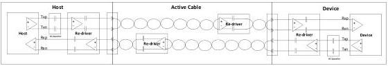
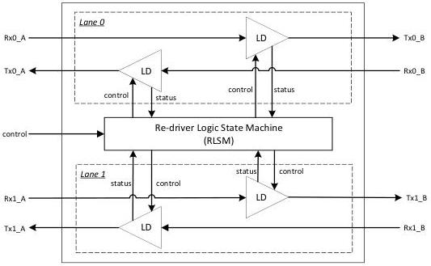

Revision 1.1
June 2022

- 525 -

Universal Serial Bus 3.2
Specification

unidirectional re-driver placed at the far-end. The actual construction of a re-driver based active cable is implementation specific. Furthermore, an active cable shall be equal or better in its loss characteristics of more than -6dB as an equivalent passive cable. Refer to the USB Type-C Specification for details.

Figure E-19. Example Link Topology with Three Re-drivers

### E.6.2 Re-driver Power Management

A re-driver is not protocol aware and will not manage its power state explicitly matching the low power link states of U1, U2 or U3. System level simplification is required to ensure the interoperability with the re-driver.

- It is highly recommended that both U1 and U2 be disabled if an on-board re-driver is deployed.

### E.6.3 Re-driver Behavioral Requirement

Shown in Figure E-20 is a conceptual block diagram of a Gen 2x2 re-driver. It consists of two lanes with each lane having two line drivers (LD). The operation of each LD is controlled by a re-driver logic state machine (RLSM). In this section, the details of RLSM and the LD functional requirements are described.

Figure E-20. Re-driver Conception Block Diagram

Copyright © 2022 USB 3.0 Promoter Group. All rights reserved.