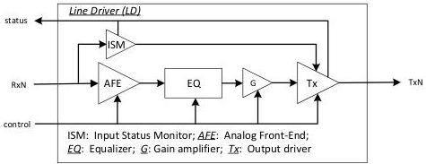

Revision 1.1
June 2022

- 526 -

Universal Serial Bus 3.2
Specification

### E.6.3.1 LD Functional Requirements

Shown in Figure E-21 is a conceptual LD block diagram. An LD consists of all the analog components in its signal path to restore the input signal to its original condition. This signal path includes, but is not limited to, an analog front-end for input signal conditioning, an equalizer and a flat gain amplifier to compensate for the channel loss, and an output driver with its source impedance meeting R$_{TX-DIFF-DC}$ defined in Table 6-18. The configuration of these components is typically done before the LD operation. Note that the LD performance also varies depending on the amount of the channel loss it is capable of compensating.

An LD includes Input Status Monitor (ISM) to monitor the input status, in order to manage the operation of its signal path and provide the input status to RLSM for link state monitoring and coordination of each LD. The input status includes the incoming LFPS signal or SS signal, the detection of LFPS electrical idle, and the transition from SS to LFPS EI.

Figure E-21. Conception Line Driver Block Diagram

Shown in Figure E-23 is the state diagram of RLSM to coordinate and synchronize the operations on all lanes in different sublinks. RLSM is defined based on the following assumptions and capabilities.

- When the transition condition "directed" is used, it implies the direction from a system.
- It is capable of differentiating among LFPS, LBPM and the SS signal. It is preferred but not required to perform LFPS and LBPM decoding. Note that the ability to perform LFPS and LBPM decoding ensures the re-driver to configure its operation according to the speed negotiation between DFP and UFP.
- It may employ the same LD configuration for both Gen 2 and Gen 1 operations, or different configurations if desired based on LBPM decoding. The mechanism for re-driver configuration, or advanced equalization adaptation are implementation specific, and they are out of the scope of this specification.
- It shall be designated by the system which lane is the config lane.
- The transition of the link configuration between x1 or x2 modes is highly desired to be based on LBPM decoding. It may be implicitly inferred through monitoring the progression on the input LFPS/LBPM or SS signals. Shown in Figure E-22 is a reference flow diagram of re-driver performing the link configuration without LBPM decoding.

Copyright © 2022 USB 3.0 Promoter Group. All rights reserved.