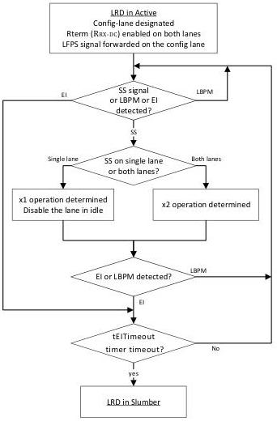

Revision 1.1
June 2022

- 527 -

Universal Serial Bus 3.2
Specification

Note that the RLSM behavioral requirement described in this section is intended for future implementations to achieve maximum interoperability.

Figure E-22. Re-driver in Active Tracking Line Configuration and Operation

### E.6.3.2 Disabled

Disabled is an optional power-on initial state. The re-driver shall meet the following requirement.

- It shall be in its lowest power state and wait for direction to enter operation.
- It shall present its high impedance to ground of ZRX-HIGH-IMP-DC-POS defined in Table 6-22 at its receiver.

The re-driver shall perform the state transition based on the following.

- The next state is Connect if directed.

Copyright © 2022 USB 3.0 Promoter Group. All rights reserved.