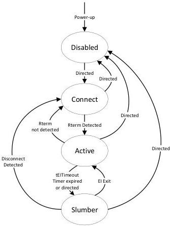

Revision 1.1
June 2022

- 528 -

Universal Serial Bus 3.2
Specification

Figure E-23. Re-driver Logic State Machine (RLSM)

### E.6.3.3 Connect

Connect is a state where the re-driver performs far-end receiver termination. It maps the LTSSM Rx.detect's sub-states of Rx.Detect.Active, Rx.Detect.Quiet. Connect may also be a power-on initial state, if it is placed in a system that is ready to start the USB operation upon power-on. The re-driver shall perform the following in Connect.

- It shall perform the periodic far-end receiver termination detection on the Configuration Lane and at both DFP and UFP at least every 8 ms as defined in Section E.3.2.1. Note that it is highly desired that the re-driver consumes no more than 200 μs to perform the far-end receiver termination detection. This is to ensure minimum interruption to potential incoming LFPS signal.
- It shall disable the transmitters. Note an LD may have its LFPS receiver enabled to improve the responsiveness of the LRD in this state. If a Polling.LFPS signal is detected, it implies its link partner has already transitioned to Polling. An LRD may not need to wait until the next cycle of far-end receiver termination detection.

The re-driver shall perform the state transition based on the following.

- The next state is Active if either of the following conditions is met.

Copyright © 2022 USB 3.0 Promoter Group. All rights reserved.