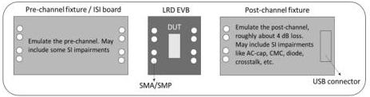

Revision 1.1
June 2022

- 530 -

Universal Serial Bus 3.2
Specification

- It shall maintain its low-impedance receiver termination (R_RX-DC).
- It shall perform the far-end receiver termination detection upon entry to the state and in at least every 100 ms tSLRxdetDelay interval afterwards, regardless its orientation towards a hub DPF or device UFP.

The re-driver shall perform the state transition based on the following.

- The next state is Disabled if Directed.
- The next state is Connect if the far-end receiver termination (R_RX-DC) is not detected.
- The next state is Active if an input LFPS signal is detected.

### E.6.4 LRD Electrical Requirements

LRD electrical requirements govern the performance of an LRD as a stand-alone component and its performance in emulated system environments. This section specifies those requirements.

#### E.6.4.1 Test Fixtures

Fixtures shown in Figure E-24 are needed to evaluate LRD electrical performance include the LRD Electrical Evaluation Board (EVB), Pre- and Post-channel Fixtures, and the standard USB 3.2 test fixtures.

Figure E-24. Illustration of LRD Test Fixtures

An LRD EVB is a small PCB mounted with an LRD as the DUT. The EVB includes SMA or SMP connectors to connect with measurement instruments or the pre- and post-channel fixtures to evaluate LRD performance. The insertion loss of the trace between the LRD and SMA/SMP in the EVB shall be controlled within 1.5 +/- 0.5 dB. There shall be a calibration structure in the EVB to remove the fixture effect in the LRD S-parameter or transfer function measurements. This calibration structure may also be used to measure the baseline jitter (without the LRD), which will be discussed in Section E.6.4.3. All the high-speed differential pairs shall be routed out to SMA's/SMP's to allow crosstalk measurements.

The pre-channel fixture emulates the interconnect of a USB 3.2 host or device between the transmitter/receiver and the LRD, while the post-channel fixture mimics the interconnect between the LRD and a USB connector, as illustrated in Figure E-25. A USB 3.2 host or device is emulated when the pre- and post-channel fixtures are connected via the LRD EVB.

Copyright © 2022 USB 3.0 Promoter Group. All rights reserved.