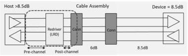

Revision 1.1
June 2022

- 531 -

Universal Serial Bus 3.2
Specification

Figure E-25. Illustration of a Typical USB 3.2 Topology with LRD

The pre- and post-channel fixtures include signal integrity impairments (loss and reflection) typically seen in a USB 3.2 host or device. The pre- and post-channel fixtures may include multiple ports to cover a range of insertion losses that an LRD is expected to support. The pre- and post-channel fixtures are standardized by USB-IF. Refer to the USB-IF whitepaper "LRD Test Fixtures" for details (to be developed).

The standard USB 3.2 test fixtures include the existing USB 3.2 transmitter and receiver test fixtures defined by USB-IF. Refer to USB 3.1 Electrical Test Fixture Topologies & Tools (https://usb.org/sites/default/files/documents/usb3p1_fixture_topologies_11-8-2017_0.pdf) for descriptions.

The electrical requirements listed in sections E.6.4.2 to E.6.4.6 are informative. The normative compliance requirement is a full channel compliance eye test discussed in E.6.4.7. Furthermore, any system that uses re-driver should go through existing USB compliance test to ensure proper system level compliance.

Although the electrical requirements are informative, re-driver vendors are strongly encouraged to provide these data in their product datasheet. This is because these electrical data are critical in system implementation, tuning, and debug, if needed.

### E.6.4.2 Linearity Requirements

Linearity is a key performance indicator for an LRD. Excessive nonlinearity from an LRD may interfere with link training and degrade eye margins.

Both low frequency or DC linearity and high frequency or AC linearity are specified. Those linearity tests use the LRD EVB to measure the relationship between LRD input and output signal amplitudes, with the following steps and processes:

- For DC linearity measurement, set a signal generator / BERT to a 20 MHz clock pattern, or 20-MHz sine wave.
- For AC linearity test, a 5-GHz sine wave shall be used.
- The calibration structure, a through connection (see Figure E-27) without the LRD, is used to calibrate the input signal amplitude. The signal generator / BERT is connected to the scope via the through and signal amplitude seen from the scope is the input amplitude. The signal generator/ BERT is tuned such that the amplitudes measured by the scope are about from 50 mV to 1200 mV.
- The signal generator/BERT can now be connected to the scope with the LRD in between and the output amplitudes can be measured by the scope. DC blocking capacitors shall be used if they are not included in the EVB.

Copyright © 2022 USB 3.0 Promoter Group. All rights reserved.