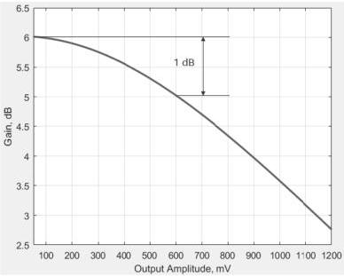

Revision 1.1
June 2022

- 532 -

Universal Serial Bus 3.2
Specification

- The Gain is calculated as the ratio of the output amplitude to input amplitude, measured in dB: Gain = 20*log10(output amplitude / input amplitude). The Gain is plotted against the output amplitude, as illustrated in Figure E-26. The output 1-dB compression amplitude Vout_1dB, is used to measure linearity.

Figure E-26. Illustration of 1-dB Compression Point

- The 1-dB compression amplitude depends on LRD EQ gains or settings. The DC and AC linearity tests shall be performed for the optimal LRD EQ settings identified in the compliance eye tests to be discussed in Section E.6.4.7.

The pass/fail criterion for the 1-dB compression amplitude Vout_1dB is ≥ 700 mV.

### E.6.4.3 Intrinsic Jitter Requirements

An LRD as an active component will introduce some jitter. Hence a jitter requirement is defined to control the intrinsic jitter from an LRD.

To obtain LRD intrinsic jitter, two measurements shall be done, as illustrated in Figure E-27. The baseline testing is to calibrate jitter using the calibration structure or the through in the EVB without the DUT LRD. The following key points shall be noted in the baseline testing:

- Jitter measurements shall be done with the LRD EQ setting identified from the compliance eye testing to be discussed in Section E.6.4.7.
- A clock or single-tone signal of 5 GHz, the Nyquist frequency of USB 3.2 Gen 2, shall be used for jitter measurements.
- The signal source should be adjusted such that the output amplitude of the LRD be about 100 mV below the AC 1-dB compression point to avoid LRD operating in non-liner region for the specific LRD EQ setting.
- The LRD S-parameter or transfer function for the specific LRD EQ setting, with fixture effect de-embedded, shall be embedded in the oscilloscope. This will ensure

Copyright © 2022 USB 3.0 Promoter Group. All rights reserved.