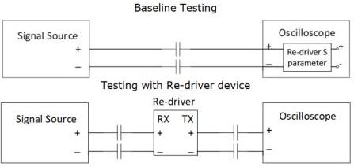

Revision 1.1
June 2022

- 533 -

Universal Serial Bus 3.2
Specification

the baseline testing and LRD measurement be done with about the same dynamic range to ensure accuracy.

- DC blocking capacitors shall be used if they are not part of the EVB.

Figure E-27. Intrinsic Jitter Test Setups

To test with an LRD, set the LRD to the specific EQ and the rest of the steps are the same as in the baseline measurement, except that no LRD s-parameter be embedded into the oscilloscope.

Utilizing the USB jitter processing software (in the oscilloscope), the baseline and LRD measurement jitters are reported in their respective components. The jitter difference at the target BER (10-12) is defined as the LRD intrinsic jitter:

$$\mathrm{DJ}_{\text{Intrinsic}} = \mathrm{DJ}_{\text{LRD measurement}} - \mathrm{DJ}_{\text{Baseline}}$$

$$\mathrm{DCD}_{\text{Intrinsic}} = \mathrm{DCD}_{\text{LRD measurement}} - \mathrm{DCD}_{\text{Baseline}}$$

$$\mathrm{RJ}_{\text{Intrinsic}} = (\mathrm{RJ}^2_{\text{LRD measurement}} - \mathrm{RJ}^2_{\text{Baseline}})0.5$$

$$\mathrm{TJ}_{\text{Intrinsic}} \text{ at } 1\text{e-12 BER} = \mathrm{DJ}_{\text{Intrinsic}} + \mathrm{DCD}_{\text{Intrinsic}} + 14.07 * \mathrm{RJ}_{\text{Intrinsic}}$$

The pass/fail criteria for the intrinsic jitter is TJ Intrinsic ≤ 0.04UI (4ps) at 1e-12 BER. Note there is no separate requirements on DJ, DCD, or RJ. It is recommended, however, to minimize DJ and DCD so that the total jitter in multiple re-driver implementation can be better managed.

### E.6.4.4 Additive Noise Requirement (σn)

σn is the standard deviation of the uncorrelated additive noise added to the output signal of an LRD. Due to the expected small magnitude of the LRD additive noise, its determination also needs two measurements: One baseline measurement to establish the measurement noise floor, and an LRD measurement to capture the total noise. The difference of the two measurements is the LRD additive noise.

In order to achieve an accurate measurement, the measurement is done with a low frequency signal of a 10 MHz clock pattern. A relatively low signal amplitude of 300 mV peak-to-peak shall be used. The additive noise test shall be done with the LRD EQ setting identified from the compliance eye testing to be discussed in Section E.6.4.7.

Copyright © 2022 USB 3.0 Promoter Group. All rights reserved.