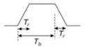

Revision 1.1
June 2022

- 534 -

Universal Serial Bus 3.2
Specification

For the baseline measurement, the LRD S-parameter or transfer function for the specific LRD EQ setting, with fixture effect de-embedded, shall be embedded in the oscilloscope. This will ensure the baseline testing and LRD measurement be done with about the same dynamic range to ensure accuracy. DC blocking capacitors shall be used if they are not part of the EVB.

For the LRD measurement, set the LRD to the specific EQ and the rest of the steps are the same as in the baseline measurement, except that no LRD s-parameter be embedded into the oscilloscope.

The low and high signal levels can be obtained from the captured waveform. The averaged standard deviation for the low and high signal levels is reported as the noise.

$$\sigma_n = (\sigma^2 \text{LRD measurement} - \sigma^2 \text{Baseline})^{0.5}$$

$\sigma_n$ shall be less or equal to 2 mV-rms.

### E.6.4.5 Integrated Return Loss Requirement

The integrated return loss is specified to manage the reflection from the LRD package and die termination. The differential return loss may be measured with a VNA using the LRD EVB, as part of the LRD transfer function characterization. The LRD EQ setting identified from the compliance eye testing shall be used and the fixture effect shall be de-embedded. The integrated return loss is calculated as:

$$IRL = db \left( \sqrt{\frac{\int_0^{f_{max}} |V_{in}(f)|^2 |RL(f)|^2 df}{\int_0^{f_{max}} |V_{in}(f)|^2 df}} \right)$$

where $f_{max} = 10$ GHz, $df <= 10$ MHz, $RL(f)$ is the measured differential return loss, referencing to an 85-ohm impedance, and $V_{in}(f)$ is the input pulse frequency spectrum:

Figure E-28. Input Pulse Frequency Spectrum

$T_b = \text{Unit Interval} = 100 \text{ ps}$
$T_r = 0 \text{ to } 100\% \text{ rise time} = 0.4T_b$

$$|V_{in}(f)| = \left| \frac{\sin(\pi f T_r)}{\pi f T_r} \cdot \frac{\sin(\pi f T_b)}{\pi f T_b} \right|$$

The integrated return loss, IRL, shall be less or equal to -17 dB.

### E.6.4.6 Integrated Crosstalk Requirement

The integrated crosstalk controls the crosstalk noise from the LRD among signal pairs. Crosstalk may be measured with a VNA using the LRD EVB. The integrated near-end and far-end crosstalk are calculated using the equations below:

$$INEXT = db \left( \sqrt{\frac{\int_0^{f_{max}} |V_{in}(f)|^2 |NEXT(f)|^2 df}{\int_0^{f_{max}} |V_{in}(f)|^2 df}} \right)$$

Copyright © 2022 USB 3.0 Promoter Group. All rights reserved.