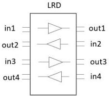
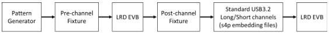

Revision 1.1
June 2022

- 535 -

Universal Serial Bus 3.2
Specification

$$IFEXT = db \left( \sqrt{\frac{\int_{0}^{f_{max}} |V_{in}(f)|^2 |FEXT(f)|^2 df}{\int_{0}^{f_{max}} |V_{in}(f)|^2 df}} \right)$$

where $NEXT(f)$ and $FEXT(f)$ are measured near-end and far-end crosstalk, respectively. The definitions of $f_{max}$, $df$, and $Vin(f)$ are the same as the integrated return loss formula above.

The integrated near-end crosstalk INEXT shall be measured between pairs in1-out2 and in2-out1, as illustrated in Figure E-29. If the LRD supports two USB lanes, INEXT between the following pairs shall also be measured: in3-out2, in3-out4, in2-out3, and in4-out3. For an LRD with two USB lanes, IFEXT between pairs in1-out3 and in2-out4 shall be measured.

INEXT and IFEXT have a strong dependency on LRD gains, which amplify the crosstalk. The optimal LRD EQ setting used for the compliance eye testing shall be used for INEXT and IFEXT measurements. The fixture effect shall be de-embedded out.

The integrated near-end and far-end crosstalk between any two signal pairs shall be less or equal to -35 dB. If the LRD includes other high-speed signals, for example, DisplayPort, it is recommended to control the crosstalk within this spec.

Figure E-29. Integrated Near-End Crosstalk Measurement Points

### E.6.4.7 Compliance Eye Requirement

The LRD compliance eye requirement and test setups follow the relevant USB 3.2 base specification and the compliance test specification (https://www.usb.org/document-library/electrical-compliance-test-specification-superspeed-usb-10-gbps-rev-10). Figure E-30 shows the Tx test path; it emulates the USB 3.2 transmitted Eye Test at 10 GT/s (TD 1.4), except that the transmitter is replaced with a pattern generator.

Figure E-30. Compliance Eye Test - Tx Path

The Rx path, illustrated in Figure E-31, shall also be tested. The standard USB 3.2 long/short fixtures are identical to what used in the USB 3.2 Rx JTOL test; they are physical fixtures, not

Copyright © 2022 USB 3.0 Promoter Group. All rights reserved.