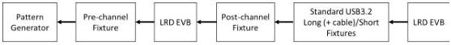

Revision 1.1
June 2022

- 536 -

Universal Serial Bus 3.2
Specification

embedding s4p files. Refer to "Electrical Compliance Test Specification Enhanced SuperSpeed Universal Serial Bus" for details.

Figure E-31. Compliance Eye Test - Rx Path

The compliance eye test shall follow the setups and requirements below. Refer to USB 3.2 compliance test spec for all other setups.

- The pattern generator is configured with the following outputs:

- 800 mV differential peak-to-peak swing
- 1 ps rms random jitter
- 0.17 UI sinusoidal jitter at 100 MHz
- 2.2 dB pre-shoot and -3.1 de-emphasis

- The test shall be done for each of the pre- and post-channel fixture ports with a prescribed insertion loss range for the short and long fixtures. LRD EQ settings may be swept for optimal result.
- The same LRD settings shall be used for both the long and short channels/fixtures during test.
- Tx and Rx-path tests may use different LRD settings.
- The eye height and eye width pass/fail criteria are 70 mV and 48 ps (both at 10-6 BER), respectively, the same as defined in the USB 3.2 spec.

### E.6.4.8 Implementation Guidelines

One of the key considerations in using an LRD is the LRD equalization range. The USB 3.2 specification has an informative insertion budget of 8.5 dB for the host/device and 23 dB for the end-to-end channel. We should make sure that the LRD equalized insertion loss of the host/device and channel be a few dB, recommend 3dB better than the spec budget. Such a margin is needed to compensate for the LRD impairments such as nonlinearity, intrinsic jitter, additive noise and crosstalk amplification.

In the example shown in Figure E-32, the unequalized (thick solid line) host insertion loss is about -10dB, just about 1.5 dB exceeding the budget. After applying LRD EQ, the equalized host insertion loss can be much less than the spec budget of 8.5 dB. So, in this example, the LRD EQ gain range is more than adequate. Actually, some of the high gain EQ will cause over equalization as the host further deviates from a low-pass filter nature of a passive channel.

Copyright © 2022 USB 3.0 Promoter Group. All rights reserved.