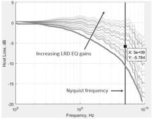
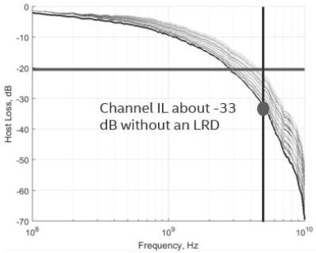

Revision 1.1
June 2022

- 537 -

Universal Serial Bus 3.2
Specification

Figure E-32. Illustration of Host Insertion Loss

Figure E-33 shows an example of a long channel insertion loss. The channel insertion loss without an LRD is about -33dB, far exceeding the spec budget of 23 dB. If we target to have an equalized channel insertion loss of 20 dB (3 dB less than the spec budget), even the highest LRD gain will not be able to achieve it. So, in this example, the LRD might not have enough EQ gain range to support this channel.

Insertion loss is certainly not the only parameter that impacts signal integrity. Channel crosstalk and reflection can seriously degrade link margin and efforts should be made by system integrators to minimize crosstalk and reflection.

Figure E-33. Illustration of Channel Insertion Loss

Copyright © 2022 USB 3.0 Promoter Group. All rights reserved.