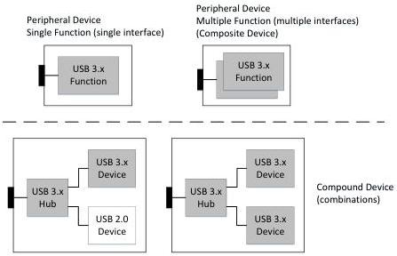
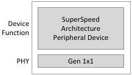

Revision 1.1
June 2022

- 27 -

Universal Serial Bus 3.2
Specification

implementation may provide appropriate full functionality when operating in the implemented USB 2.0 speed mode. Simultaneous operation of Enhanced SuperSpeed and USB 2.0 speed modes is not allowed for peripheral devices.

USB 3.2 devices within a single physical package (i.e., a single peripheral) can consist of a number of functional topologies including single function, multiple functions on a single peripheral device (composite device), and permanently attached peripheral devices behind an integrated hub (compound device) (see Figure 3-4).

Figure 3-4. Examples of Supported USB 3.2 USB Physical Device Topologies

An Enhanced SuperSpeed portion of a peripheral device may only be assembled into one of the following configurations:

- SuperSpeed Only Peripheral Device. This device implementation is comprised of a Gen 1x1 only PHY and conforms to the SuperSpeed link, protocol and device specifications; see Figure 3-5.

Figure 3-5. SuperSpeed Only Enhanced SuperSpeed Peripheral Device Configuration

- Enhanced SuperSpeed Device. This is an attachable device that must implement both SuperSpeed and SuperSpeedPlus device architecture and at all Gen X x Y speeds; see Figure 3-6.

Copyright © 2022 USB 3.0 Promoter Group. All rights reserved.