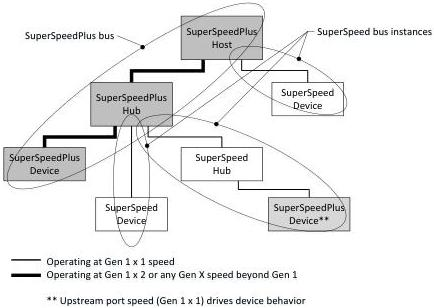

Revision 1.1
June 2022

- 29 -

Universal Serial Bus 3.2
Specification

- SuperSpeed hubs actively participate in the (end-to-end) protocol in several ways, including:
- Routes out-bound packets to explicit downstream ports.
- Routes in-bound packets from a downstream port to the upstream port.
- Propagates the timestamp packet to all downstream ports not in a low-power state.
- Detects when packets encounter a port that is in a low-power state. The hub transitions the targeted port out of the low-power state and notifies the host and device (in-band) that the packet encountered a port in a low-power state.

### 3.2.6.2.2 SuperSpeedPlus Hub

A SuperSpeedPlus hub serves a special role when its upstream facing port is operating at Gen 1x2 or any Gen X speed beyond Gen 1. A SuperSpeedPlus hub isolates downstream signaling environments from the upstream signaling environment utilizing a store-and-forward architecture. Figure 3-7 illustrates a SuperSpeedPlus host connected to a mixture of SuperSpeedPlus hubs and devices and SuperSpeed hubs and devices.

In contrast to the SuperSpeed hub, which is characterized as a repeater/forwarder hub architecture, the SuperSpeedPlus hub is characterized as a store-and-forward hub because it can receive one or more entire DPs before transmitting up or downstream. The store-and-forward architecture of a SuperSpeedPlus hub allows a host to schedule multiple endpoint bursts, across multiple endpoints, for both in-bound and out-bound flows, as long as they bursts are to SuperSpeedPlus endpoints. The SuperSpeedPlus host is also able to use the same SuperSpeedPlus scheduling rules across SuperSpeed endpoints on different downstream SuperSpeed bus instances. The SuperSpeedPlus host must use SuperSpeed only bus scheduling rules for all SuperSpeed endpoints on the same SuperSpeed bus instance.

Figure 3-7. Multiple SuperSpeed Bus Instances in an Enhanced SuperSpeed System

A SuperSpeedPlus hub consists of three logical components: a SuperSpeedPlus hub controller, a SuperSpeedPlus upstream controller and a SuperSpeedPlus downstream controller (one for each downstream facing port).

Copyright © 2022 USB 3.0 Promoter Group. All rights reserved.