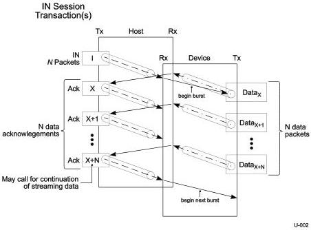

Revision 1.1
June 2022

- 37 -

Universal Serial Bus 3.2
Specification

- All the data for the transfer is successfully received.
- The endpoint responds with a packet that is less than the endpoint's maximum packet size.
- The endpoint responds with an error.

Figure 4-1. Enhanced SuperSpeed IN Transaction Protocol

### 4.4.3 OUT Transfers

The host and device shall adhere to the constraints of the transfer type and endpoint characteristics.

A host initiates a transfer by sending a burst of data packets to the device. Each data packet contains the addressing information required to route the packet to the intended endpoint. It also includes the sequence number of the data packet. For a non-isochronous transaction, the device returns an acknowledgement packet including the sequence number for the next data packet and implicitly acknowledging the current data packet.

Note that even though the device is required to send an acknowledgement packet for every data packet received, the host can send up to the maximum burst size number of data packets to the device without waiting for an acknowledgement.

Copyright © 2022 USB 3.0 Promoter Group. All rights reserved.