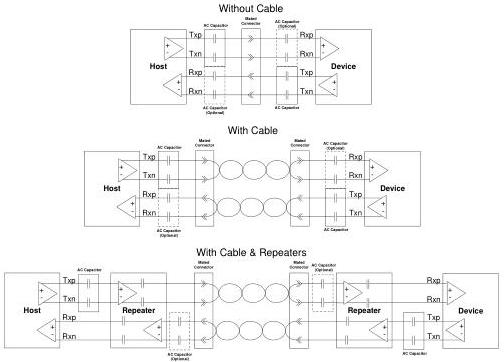

Revision 1.1
June 2022

- 55 -

Universal Serial Bus 3.2
Specification

Figure 6-5. Channel Models

### 6.2.1 Measurement Overview

The normative eye diagram is to be measured through compliance channels that represent long and short channels in order to cover the range of losses seen by real applications. These reference channels for testing at Gen 1 speed are described in the USB 3.0 SuperSpeed Equalizer Design Guidelines white paper. Reference channels for testing Gen 2 speed are described in a companion white paper posted on the USB-IF website. The eye diagram is measured using the appropriate clock recovery function described in Section 6.5.2.

Due to non-ideal channel characteristics, the eye diagram at the receiver may be completely closed. Informative receiver equalization functions are provided in Section 6.8.2 that are optimized for the compliance channels and are used to open the receiver eyes.

This methodology allows a silicon vendor to design the channel and the component as a matched pair. It is expected that a silicon component will have layout guidelines that must be followed in order for the component to meet the overall specification and the eye diagram at the end of the compliance channel.

Test points for Enhanced SuperSpeed systems are defined in Table 6-1 and Figure 6-6. The TP2 mid-point is defined to be after the mated connector on the plug side with the plug test board with the traces de-embedded. The TP3 mid-point is defined to be after the mated connector on the receptacle side with the USB Type-C cable test fixture.

Copyright © 2022 USB 3.0 Promoter Group. All rights reserved.