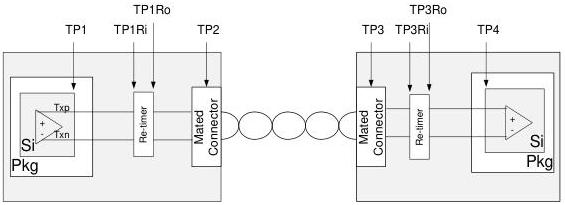

Revision 1.1
June 2022

- 56 -

Universal Serial Bus 3.2
Specification

Table 6-1. Electrical Test Points

[tbl-35.md](tbl-35.md)

Figure 6-6. Electrical Test Points

Note that simultaneous USB 2.0 and SuperSpeed Gen 1 or Gen 2 operation is required for downstream facing ports and for upstream facing ports on Hubs.

### 6.2.2 Channel Overview

A PHY is a transmitter and receiver that operate together and are located on the same component. A channel connects two PHYs together with two unidirectional differential pairs of pins for a total of four wires. The PHYs are required to be AC coupled. The AC coupling capacitors are associated with the transmitter.

### 6.3 Symbol Encoding

#### 6.3.1 Gen 1 Encoding

The Gen 1 PHY uses the 8b/10b transmission code. The definition of this transmission code is identical to that specified in ANSI X3.230-1994 (also referred to as ANSI INCITS 230-1994), clause 11. As shown in Figure 6-7, ABCDE maps to abcdei and FGH maps to fghj.

Copyright © 2022 USB 3.0 Promoter Group. All rights reserved.